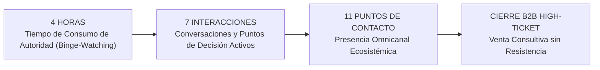
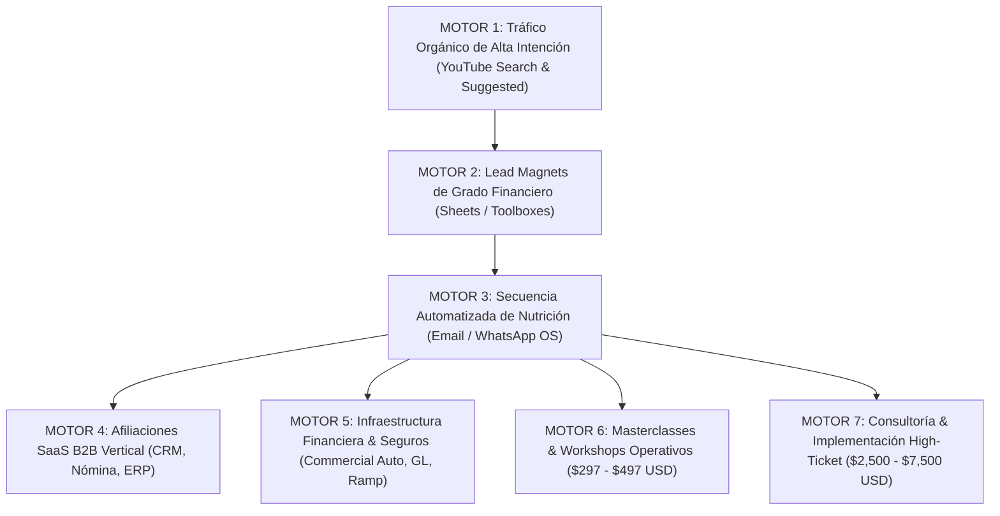

# Documento Maestro de Estrategia de Activos Comerciales de YouTube 2026
## Monoga OS Media Holding — División Estrategia B2B y Motores de Adquisición de Clientes (CAC)
**Estratega Principal:** Eloísa Wolf (ex-Google / YouTube Media Holding Strategist)  
**Canales & Ecosistemas:**  
1. **Sebastián Monoga** — *USA Contractor B2B & Home-Service Business Operations* (Mercado EE. UU. / Dólares).  
2. **Daniel Monoga** — *Custom Operating Systems & Workflow Automation* (Mercado Latam & Global B2B / Dólares).  
**Fecha de Publicación:** Septiembre 2026  
**Clasificación:** Activo Estratégico Confidencial / Propiedad Intelectual Monoga OS  

---

## 1. Manifiesto y Tesis Económica: YouTube como Empresa de Medios y Motor de CAC

### 1.1 El Fin de las Métricas de Vanidad en YouTube B2B
En el ecosistema B2B de alto ticket, las métricas tradicionales de YouTube (vistas totales, suscriptores brutos, viralidad efímera) son irrelevantes y financieramente engañosas. 

> [!IMPORTANT]
> **Principio Wolf #1:** YouTube no es una red social de entretenimiento para creadores; es una **empresa de medios propietaria** y un **motor de reducción radical del Costo de Adquisición de Clientes (CAC)**.

Un millón de visualizaciones de curiosos sin presupuesto genera un RPM de AdSense de $3 a $6 USD y cero conversiones comerciales. En contraste, **1,200 visualizaciones de dueños de empresas de pintura, drywall, HVAC o directores de operaciones con dolores críticos de caja y flujo operativo** pueden generar $45,000 USD en contratos de consultoría, implementaciones de software (CRM/ERP) y comisiones de infraestructura financiera B2B.

```
┌────────────────────────────────────────────────────────────────────────┐
│                   PARADIGMA TRADICIONAL VS B2B HOLDING                 │
├───────────────────────────────────┬────────────────────────────────────┤
│ Creador de Contenido / Entretenimiento │ Media Holding B2B (Monoga OS)     │
├───────────────────────────────────┼────────────────────────────────────┤
│ • Objetivo: Vistas y AdSense      │ • Objetivo: Pipeline SQLs y CAC $0 │
│ • Métricas: CPM, Likes, Algoritmo │ • Métricas: LTV, CAC, Payback, SQLs│
│ • Contenido: Tendencias / Hype    │ • Contenido: Solución a Dolores    │
│ • Audiencia: Consumidores pasivos │ • Audiencia: Decisores con Budget  │
│ • Monetización: Patrocinios $     │ • Monetización: 7 Motores Propios  │
└───────────────────────────────────┴────────────────────────────────────┘
```

### 1.2 La Ecuación Financiera del Canal B2B
Un canal de YouTube optimizado como activo comercial transforma el gasto publicitario en capital de autoridad acumulativo (Compound Media Equity).

$$\text{CAC Orgánico YouTube} = \frac{\text{Costo de Producción + Infraestructura Funnel}}{\text{N° de Clientes Cerrados (High-Ticket + SaaS + Backend)}}$$

A diferencia del tráfico pagado (Meta Ads / Google Ads), donde el CAC aumenta linealmente cuando se apaga el presupuesto publicitario, los **activos evergreen de YouTube se deprecian negativamente**: cada video indexado en modo *Searching* y estructurado para *Streaming* sigue capturando leads calificados a costo marginal cero durante 24 a 36 meses.

---

## 2. La Regla 4-7-11 Aplicada a B2B y Contratistas en USA

La **Regla 4-7-11** (formulada en la psicología de compra B2B por Alex Hormozi y refinada por Eloísa Wolf para entornos técnicos y de servicios) establece el umbral neurobiológico exacto para que un tomador de decisiones confíe una inversión de $2,500 a $25,000 USD sin objeciones de precio:



### 2.1 Las 4 Horas de Autoridad (The Authority Binge)
* **El Problema:** Nadie contrata una implementación de $5,000 USD ni confía la reestructuración de su nómina tras ver un Short de 30 segundos.
* **La Solución en el Ecosistema Monoga:**
  * Videos largos estructurados de 12 a 18 minutos con densidad técnica real (hojas de cálculo, código, flujos de CRM, desglose de P&L).
  * Listas de reproducción temáticas en bucle (*Binge Playlists*): el contratista o gerente consume 4 a 6 videos consecutivos en un fin de semana (alcanzando las 4 horas de inmersión total).

### 2.2 Las 7 Interacciones Calificadas
No son impactos pasivos; son decisiones activas ejecutadas por el prospecto:
1. **Interacción 1:** Clic en el video largo tras búsqueda intencional en YouTube/Google.
2. **Interacción 2:** Descarga del Lead Magnet funcional en la descripción (captura de datos).
3. **Interacción 3:** Apertura y ejecución de la hoja de cálculo / matriz de costos (interacción táctil con la solución).
4. **Interacción 4:** Respuesta a correo automatizado o mensaje de bienvenida de WhatsApp OS.
5. **Interacción 5:** Consumo de un Short o Post de Comunidad derivado con caso de estudio.
6. **Interacción 6:** Completado del formulario de autodiagnóstico operativo (*Scorecard*).
7. **Interacción 7:** Agendamiento de la Sesión Estratégica de Diagnóstico con el equipo de Monoga OS.

### 2.3 Los 11 Puntos de Contacto Omnicanal
1. Video principal en YouTube (A-Roll + Screencast).
2. Shorts de choque / corte vertical (YouTube Shorts / IG Reels).
3. Post de Comunidad con tablas y gráficos financieros.
4. Lead Magnet interactivo en Google Sheets / Notion.
5. Correo de entrega inmediata con protocolo de uso.
6. Secuencia educativa de 5 correos ("Escuela de Operaciones").
7. Mensajería directa automatizada (WhatsApp Business / SMS de confirmación).
8. Página de autodiagnóstico interactivo (*Health Scorecard*).
9. Invitación a Workshop / Masterclass mensual en vivo.
10. Retargeting orgánico en YouTube (sugeridos en panel lateral).
11. Llamada 1 a 1 de revisión de mapa de proceso / diagnóstico de márgenes.

---

## 3. Clasificación de las 4 'S' en YouTube (Google Media Framework)

Para maximizar el algoritmo de YouTube sin comprometer el valor comercial, cada pieza de contenido se categoriza dentro de la matriz de las **4 'S'**:

```
                       ALTA INTENCIÓN DE BÚSQUEDA
                                  ▲
                                  │
             [ SEARCHING ]        │        [ STREAMING ]
        • Solución de Dolores     │   • Autoridad Profunda
        • Evergreen SEO           │   • Binge-Watching
        • Tráfico Frío Cualificado│   • Retención de Decisores
                                  │
  ────────────────────────────────┼────────────────────────────────► TIEMPO DE CONSUMO
                                  │
             [ SCROLLING ]        │        [ SHOPPING ]
        • Shorts / Micro-Hooks    │   • Activación Comercial
        • Patrón de Interrupción  │   • Lead Magnets & Toolboxes
        • Top-of-Funnel Viral     │   • Conversión a CRM / High-Ticket
                                  │
                                  ▼
                       BAJA INTENCIÓN / DESCUBRIMIENTO
```

### 3.1 Searching (Modo Búsqueda Crítica — 40% del Esfuerzo)
* **Psicología:** El usuario entra con un problema urgente y específico que le cuesta dinero o tranquilidad jurídica.
* **Ejemplos Sebastián:** *"cómo calcular workers comp pintura texas"*, *"cuánto cobrar por pie cuadrado drywall 2026"*, *"1099 vs w2 multas irs"*.
* **Ejemplos Daniel:** *"automatizar cotizaciones whatsapp crm"*, *"sistema operativo empresarial a medida"*, *"integrar supabase con nextjs procesos"*.
* **Objetivo:** Captura de tráfico con altísima intención comercial (High Purchase Intent).

### 3.2 Streaming (Modo Binge & Construcción de Autoridad — 35% del Esfuerzo)
* **Psicología:** El usuario ya reconoció que el canal resuelve sus problemas reales y dedica 1 a 2 horas a consumir estudios de caso, auditorías en vivo y desgloses de sistemas.
* **Formatos:** Auditorías financieras completas, documentales de implementación de software, directos mensuales de resolución de dudas complejas.
* **Objetivo:** Cumplir las 4 horas de la regla 4-7-11 y destruir objeciones de competencia técnica.

### 3.3 Scrolling (Modo Interrupción de Patrón — 15% del Esfuerzo)
* **Psicología:** El usuario está en modo pasivo en Shorts o Reels; requiere un golpe numérico o un error contraintuitivo para detener el scroll.
* **Formato:** Videos de 45 a 58 segundos extraídos del A-Roll del video largo. Estructura: *Hook de Impacto (0-3s) -> Dato Financiero Incómodo (4-35s) -> CTA al video largo o herramienta (36-50s)*.
* **Objetivo:** Canalizar tráfico rápido hacia el activo largo y la descripción.

### 3.4 Shopping (Modo Activación y Conversión — 10% del Esfuerzo)
* **Psicología:** El usuario ya confía en el método y desea la herramienta exacta para no construirla desde cero.
* **Mecanismos:** Enlaces directos a Lead Magnets protegidos, enlaces de afiliación a CRM (Housecall Pro, Jobber, Gusto) y agendas de diagnóstico.
* **Objetivo:** Captura de datos de contacto (First-Party Data) y monetización directa.

---

## 4. El Embudo Maestro de 7 Motores de Ingresos

Cada video publicado en el ecosistema Monoga OS está conectado directamente a una cascada de monetización estructurada en 7 motores independientes pero sinérgicos:



### Detalle de los 7 Motores de Ingreso:
1. **Motor 1 — Tráfico Orgánico de Búsqueda Calificada:** Adquisición continua a costo marginal cero. Posicionamiento en YouTube y Google Search de términos operativos.
2. **Motor 2 — Lead Magnets Funcionales (Toolboxes):** Herramientas de cálculo reales en Google Sheets protegidas (no PDFs teóricos). Requisito de captura: Nombre, Email, Teléfono, Estado/País, Facturación aproximada y Número de empleados.
3. **Motor 3 — Secuencia Automatizada de Nutrición Multicanal:** Flujo inteligente de 5 correos + mensajes WhatsApp con casos reales, superación de objeciones y puentes a diagnóstico.
4. **Motor 4 — Comisiones SaaS Vertical B2B:** Ingresos recurrentes o CPA de alto valor por adopción de software especializado:
   * *Sebastián:* Housecall Pro, Jobber ($150-$250 CPA / 20-30% recurrente), Gusto Payroll ($100-$300 por cuenta activa).
   * *Daniel:* Supabase, Vercel, Make, herramientas de IA corporativa.
5. **Motor 5 — Alianzas de Infraestructura Financiera y Aseguradora:**
   * *Sebastián:* Pólizas comerciales (Next Insurance, Hiscox, CoverWallet: $50-$120 por lead cualificado), Tarjetas corporativas de combustible y materiales (Ramp, Chase Business: $200-$500 por apertura).
6. **Motor 6 — Workshops y Masterclasses Operativas ($297 - $497 USD):** Eventos intensivos virtuales de 1 día (ej. *"De Chalán a CEO: Sistematización de Estimates y Finanzas para Home Services"* o *"Arquitectura de Sistemas Internos con Jarvis y MARAL OS"*).
7. **Motor 7 — Consultoría & Implementación High-Ticket ($2,500 - $7,500 USD):** Servicios llave en mano donde el equipo de Monoga OS diseña, configura y entrega el sistema operativo, CRM o catálogo de precios listo para operar.

---

## 5. Mapeo Estratégico de los 8 Episodios Maestros

A continuación se detalla la calibración comercial de cada episodio del paquete de lanzamiento:

```
┌───────────────────────────────────────────────────────────────────────────────────────────────────────────────────┐
│                                TABLA MAESTRA DE ACTIVACIÓN COMERCIAL (8 EPISODIOS)                                │
├────┬─────────────────────────────┬─────────────┬───────────────────────────────┬─────────────────┬────────────────┤
│ Ep │ Título del Activo Comercial │ Modo 4 'S'  │ Lead Magnet Funcional         │ Motor Principal │ Ticket / Meta  │
├────┼─────────────────────────────┼─────────────┼───────────────────────────────┼─────────────────┼────────────────┤
│ 1  │ El Costo REAL de un         │ Searching / │ True Employee Cost Calculator │ Motor 2 / 4 / 5 │ Gusto Payroll  │
│    │ Empleado a $20/h en USA     │ Streaming   │ (Labor Burden Master Sheet)   │ (Nómina/Seguro) │ + GL Insurance │
├────┼─────────────────────────────┼─────────────┼───────────────────────────────┼─────────────────┼────────────────┤
│ 2  │ Cotizar para Ganar 40% de   │ Searching / │ Job Costing & Pricing Matrix  │ Motor 2 / 6 / 7 │ Workshop $297  │
│    │ Margen Neto Real            │ Streaming   │ 2026 (Sheets Dinámica)        │ (Pricing OS)    │ + Consultoría  │
├────┼─────────────────────────────┼─────────────┼───────────────────────────────┼─────────────────┼────────────────┤
│ 3  │ Adiós Papel y WhatsApp:     │ Searching / │ Guía Comparativa & Setup:     │ Motor 4 / 7     │ Housecall/Jobber│
│    │ Cómo un CRM Duplica Ventas  │ Shopping    │ Housecall Pro vs Jobber       │ (CRM SaaS)      │ + Setup $2,500 │
├────┼─────────────────────────────┼─────────────┼───────────────────────────────┼─────────────────┼────────────────┤
│ 4  │ Auditoría Financiera: $45K  │ Streaming / │ Contractor Business Health    │ Motor 2 / 7     │ Auditoría 1a1  │
│    │ al Mes pero $0 en la Cuenta │ Authority   │ Scorecard (Diagnóstico 3 min) │ (High-Ticket)   │ $3,500 USD     │
├────┼─────────────────────────────┼─────────────┼───────────────────────────────┼─────────────────┼────────────────┤
│ 5  │ 1099 vs W-2: El Error Legal │ Searching / │ Subcontractor Agreement &     │ Motor 2 / 5     │ Next/Hiscox GL │
│    │ que Destruye tu Empresa     │ Compliance  │ DOL Compliance Checklist      │ (Legal/Seguros) │ + Workers Comp │
├────┼─────────────────────────────┼─────────────┼───────────────────────────────┼─────────────────┼────────────────┤
│ 6  │ El Truco para Ganar 25%     │ Searching / │ Material Markup & Overhead    │ Motor 2 / 5     │ Ramp Corporate │
│    │ Extra en Materiales         │ Shopping    │ Recovery Calculator           │ (Crédito B2B)   │ Card ($500 CPA)│
├────┼─────────────────────────────┼─────────────┼───────────────────────────────┼─────────────────┼────────────────┤
│ 7  │ Cobrar Change Orders sin    │ Searching / │ Change Order Legal Template & │ Motor 2 / 6 / 7 │ Masterclass    │
│    │ Discutir con el Cliente     │ Streaming   │ Lien Waiver Pack (Word/PDF)   │ (Contratos B2B) │ + Contratos OS │
├────┼─────────────────────────────┼─────────────┼───────────────────────────────┼─────────────────┼────────────────┤
│ 8  │ Salir de la Obra: Contratar │ Streaming / │ Foreman Hiring Blueprint &    │ Motor 6 / 7     │ Implementación │
│    │ al Primer Capataz / Lead    │ Scale       │ Production Pay Matrix         │ (Escalamiento)  │ $5,000-$7,500  │
└────┴─────────────────────────────┴─────────────┴───────────────────────────────┴─────────────────┴────────────────┤
```

### 5.1 Desglose de Activación por Episodio

#### Episodio 1: "El costo REAL de contratar un empleado a $20/h en USA"
* **Tesis Financiera:** Demostrar que un salario de $20/h le cuesta al dueño entre $27.80 y $33.40/h al sumar FICA, FUTA, SUTA, Workers' Comp y tiempo improductivo.
* **Activación 4 'S':** *Searching* (Búsqueda orgánica de costos laborales) + *Streaming* (Desglose en vivo de hoja de cálculo).
* **Conexión de Motores:**
  * *Motor 2:* Descarga del *Labor Burden Calculator*.
  * *Motor 4 & 5:* Enlace de afiliado a Gusto Payroll y cotizador de Workers' Comp (Next Insurance).
  * *CTA Verbal:* "Descarga la calculadora en la descripción con la palabra `BURDEN` y ponle tus números antes de contratar el lunes."

#### Episodio 2: "Cómo cotizar proyectos para ganar 40% de margen neto sin perder clientes"
* **Tesis Financiera:** Explicar la diferencia mortal entre *Margin* y *Markup*, enseñando cómo calcular el cobro por pie cuadrado absorbiendo el Overhead de la empresa.
* **Activación 4 'S':** *Searching* + *Shopping*.
* **Conexión de Motores:**
  * *Motor 2:* *Job Costing & Pricing Matrix 2026*.
  * *Motor 6:* Oferta al Workshop de Pricing y Estimaciones de Alto Margen ($297 USD).
  * *Motor 7:* Diagnóstico de catálogo de precios personalizado.

#### Episodio 3: "Dejamos de usar papel y WhatsApp: Cómo un CRM duplicó nuestra facturación"
* **Tesis Financiera:** Cuantificar el dinero perdido en cotizaciones sin seguimiento, citas olvidadas y retrasos en cobro por usar notas de papel o chats desordenados.
* **Activación 4 'S':** *Searching* (Búsqueda de software para contratistas) + *Shopping* (Demostración de interfaz).
* **Conexión de Motores:**
  * *Motor 4:* Afiliación directa a Housecall Pro y Jobber (14 días gratis + 20% descuento).
  * *Motor 7:* Paquete de Implementación Llave en Mano CRM Monoga OS ($2,500 USD).

#### Episodio 4: "Auditoría en Vivo: Factura $45K al mes pero gana menos que sus chalanes"
* **Tesis Financiera:** Estudio de caso real de un contratista de pintura con alto volumen pero margen neto negativo por compras descontroladas y retrabajos no cobrados.
* **Activación 4 'S':** *Streaming* (Formato documental de alta retención).
* **Conexión de Motores:**
  * *Motor 2:* *Contractor Business Health Scorecard* (Test interactivo).
  * *Motor 7:* Auditoría Financiera y Operativa 1 a 1 ($3,500 USD).

#### Episodio 5: "¿1099 o W-2? El error legal que puede destruir tu compañía este año"
* **Tesis Financiera:** Desglosar los 11 criterios del DOL y las penalidades del IRS por clasificar erróneamente a empleados como subcontratistas.
* **Activación 4 'S':** *Searching* (Término crítico de cumplimiento).
* **Conexión de Motores:**
  * *Motor 2:* *Subcontractor Agreement & Compliance Checklist*.
  * *Motor 5:* Pólizas de General Liability con certificados de seguro (COI) automáticos vía Hiscox / Next.

#### Episodio 6: "El truco de las grandes compañías para ganar 25% extra en materiales legalmente"
* **Tesis Financiera:** Cómo aplicar recargos legítimos por gestión de compras, transporte, desperdicio y almacenamiento, sumado a líneas de crédito comerciales con cashback.
* **Activación 4 'S':** *Searching* + *Shopping*.
* **Conexión de Motores:**
  * *Motor 2:* *Material Markup & Overhead Recovery Calculator*.
  * *Motor 5:* Afiliación a tarjeta corporativa Ramp / Chase Business ($500 bono de bienvenida).

#### Episodio 7: "Cómo cobrar los trabajos extra (Change Orders) sin que el cliente se enoje"
* **Tesis Financiera:** Eliminar el "ya que estás aquí, hazme esto otro" implementando Change Orders digitales firmados antes de mover un solo dedo en la obra.
* **Activación 4 'S':** *Searching* + *Streaming*.
* **Conexión de Motores:**
  * *Motor 2:* *Change Order Template & Lien Waiver Pack*.
  * *Motor 6:* Masterclass de Negociación y Protección de Cobro ($297 USD).

#### Episodio 8: "Cómo salir de la obra: El paso a paso para contratar a tu primer capataz (Foreman)"
* **Tesis Financiera:** La transición del autoempleado al dueño de empresa mediante estructura de incentivos por rendimiento (Production Pay) sin quebrar el margen.
* **Activación 4 'S':** *Streaming* (Contenido de liderazgo y escalamiento).
* **Conexión de Motores:**
  * *Motor 2:* *Foreman Hiring Blueprint & Production Pay Matrix*.
  * *Motor 7:* Programa de Mentoría e Implementación de Escalamiento Operativo Monoga OS ($5,000 - $7,500 USD).

---

## 6. Sinergia B2B: Canal Sebastián Monoga (USA) ⟷ Canal Daniel Monoga (Latam/Global)

El holding Monoga OS opera con una arquitectura de marca compartida donde cada canal alimenta la credibilidad y el pipeline del otro:

```
┌────────────────────────────────────────────────────────────────────────┐
│                   ECOSISTEMA MONOGA OS MEDIA HOLDING                   │
├───────────────────────────────────┬────────────────────────────────────┤
│ Sebastián Monoga (USA B2B)        │ Daniel Monoga (Latam/Global B2B)   │
├───────────────────────────────────┼────────────────────────────────────┤
│ • Vertical: Home Services &       │ • Vertical: Custom Operating       │
│   Construcción en EE. UU.         │   Systems, AI Workflows & ERPs     │
│ • Moneda: USD ($)                 │ • Moneda: USD ($)                  │
│ • Casos: Jobber, Gusto, P&L de    │ • Casos: Jarvis, MARAL OS, Next.js │
│   obras, Subcontratistas          │   Supabase, Automatizaciones       │
│ • Dolor: Fuga de margen en obra,  │ • Dolor: Desorden operativo, chats │
│   miedo al IRS, falta de CRM      │   fragmentados, tareas manuales    │
│ • Oferta: Implementación CRM B2B, │ • Oferta: Diseño de Sistemas a     │
│   Price Books, Consultoría COO    │   Medida, Integraciones Seguras    │
└───────────────────────────────────┴────────────────────────────────────┘
```

### Puentes de Tráfico Cruzado:
1. **El Caso de Estudio de MARAL OS:** Sebastián muestra cómo una empresa de servicios y manufactura gestiona cotizaciones automatizadas con IA y WhatsApp bajo control humano (desarrollado por Daniel), derivando prospectos de software a Daniel.
2. **El Sistema de Finanzas de Jarvis:** Daniel muestra la infraestructura técnica de control de finanzas y automatización de reportes que Sebastián utiliza para auditar contratistas en USA.

---

## 7. Protocolo de Producción Lean Studio OS (180 Minutos Semanales)

Para garantizar sostenibilidad operativa sin requerir equipos masivos de producción, cada episodio se rige por un cronograma estricto de 3 horas totales de trabajo:

```
┌────────────────────────────────────────────────────────────────────────┐
│             PROTOCOLO DE PRODUCCIÓN SEMANAL (180 MINUTOS)              │
├──────────┬───────────────────────────────┬─────────────┬───────────────┤
│ Día      │ Actividad Editorial           │ Tiempo Máx. │ Entregable    │
├──────────┼───────────────────────────────┼─────────────┼───────────────┤
│ Lunes    │ Selección de Dolor + Evidencia│ 20 min      │ Brief 1 pág.  │
│ Martes   │ Demo Sintética + Hoja Sheets  │ 25 min      │ Set de prueba │
│ Miércoles│ Grabación A-Roll + Screencast │ 75 min      │ Bruto 4K      │
│ Jueves   │ Edición Esencial + 2 Shorts   │ 45 min      │ Paquete final │
│ Viernes  │ Sanitización PII + Publicación│ 15 min      │ Activo en vivo│
├──────────┴───────────────────────────────┴─────────────┴───────────────┤
│ TOTAL: 3 HORAS EXACTAS POR EPISODIO                                    │
└────────────────────────────────────────────────────────────────────────┘
```

### Reglas de Saneamiento y Privacidad (Zero PII Leakage):
* Toda demostración de software o P&L debe usar datos sintéticos (*Mock Data*).
* Nombres de clientes, números de teléfono, direcciones físicas y montos reales de cuentas bancarias deben ser reemplazados por perfiles ficticios estandarizados.
* Enfoque en la **lógica del proceso y la decisión financiera**, nunca en la exposición de datos privados.

---

## 8. Cuadro de Mando de Rendimiento y Atribución Comercial

El éxito del canal se medirá trimestralmente en el Consejo Directivo de Monoga OS a través del siguiente Scorecard:

```
┌────────────────────────────────────────────────────────────────────────┐
│             SCORECARD TRIMESTRAL DE RENDIMIENTO B2B (OKRs)             │
├───────────────────────────────────────────┬──────────────┬─────────────┤
│ Métrica de Negocio (No Vanidad)           │ Meta Q4-2026 │ Meta Q1-2027│
├───────────────────────────────────────────┼──────────────┼─────────────┤
│ 1. Descargas de Lead Magnets (M2)         │ 600 leads    │ 1,500 leads │
│ 2. Nuevos Registros Calificados en CRM    │ 120 cuentas  │ 300 cuentas │
│ 3. Altas en Software SaaS / Gusto (M4)    │ 35 activas   │ 90 activas  │
│ 4. Solicitudes de Diagnóstico 1 a 1       │ 24 agendas   │ 60 agendas  │
│ 5. Contratos High-Ticket Cerrados (M7)    │ 4 contratos  │ 10 contratos│
│ 6. Ingreso Bruto Atribuido a YouTube      │ $18,000 USD  │ $45,000 USD │
│ 7. CAC Promedio de Cliente High-Ticket    │ < $250 USD   │ < $120 USD  │
└───────────────────────────────────────────┴──────────────┴─────────────┘
```

---

## 9. Conclusión y Visto Bueno Estratégico

El canal de YouTube de Sebastián Monoga y el de Daniel Monoga no compiten por el algoritmo de entretenimiento: **dominan la intención de búsqueda de dueños de negocio con presupuestos activos**. Con la implementación de este marco, cada video producido pasa a ser un activo de balance general que reduce el CAC corporativo a cero y construye un monopolio de autoridad en servicios operativos B2B.

**Aprobado por:** Eloísa Wolf — *Lead Media Holding Strategist*  
**Monoga OS Editorial & Commercial Operations**
