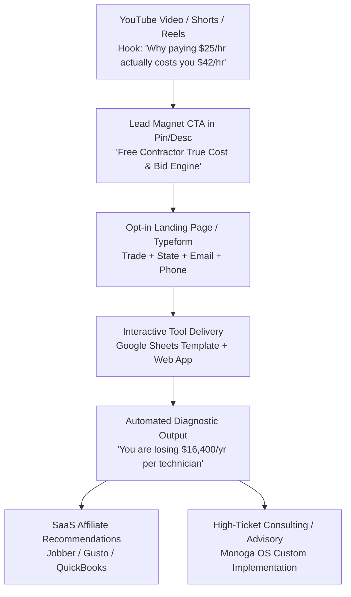
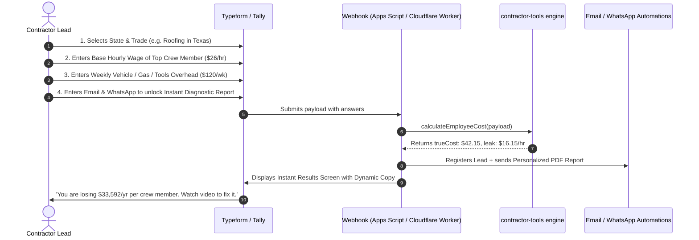

# Contractor Lead Magnet Toolbox Specification: Architecture, Conversion Funnel & SaaS Monetization

> **Author**: Product & Conversion Systems Architect (Monoga OS)  
> **Target Audience**: Construction Contractors, Trade Business Owners (HVAC, Roofing, Remodeling, Plumbing, Electrical, Framing)  
> **Funnel Owners**: Sebastián & Daniel Monoga  
> **Code Artifacts**: `tools/contractor-tools/employee-cost-calculator.js` & `tools/contractor-tools/job-pricing-calculator.js`  
> **Status**: Production Ready / Test Verified (100% Pass)

---

## 1. Executive Context & Funnel Economics

### 1.1 The High-Ticket Contractor Reality
Most contractors in the United States fail not from poor craftsmanship, but from **blind bidding and miscalculated labor burden**. 
- A contractor hires a carpenter at **$28.00/hr**, pays him for 40 hours, and bids jobs assuming labor costs him $28.00 to $32.00/hr.
- In reality, after Workers' Comp (8–12%), Payroll Taxes (FICA + SUTA + FUTA ~8–11%), non-billable downtime (driving, supply runs, morning huddles: 5 hrs/wk), paid holidays/sick leave (80 hrs/yr), and assigned truck/tool overhead, the **true cost per billable hour is $44.46/hr (+58.8% higher)**.
- When pricing jobs, contractors confuse **Markup** with **Margin**: they add a "20% markup" to direct costs, thinking they made 20% net profit, only to find that company overhead (15%) ate their entire profit, leaving them broke at tax season.

### 1.2 The Lead Magnet Value Proposition
This toolbox solves the contractor's bleeding neck problem in **under 3 minutes**:
1. **Tool 1 (`employee-cost-calculator.js`)**: Diagnoses the exact "Hidden Hourly Leak" per employee.
2. **Tool 2 (`job-pricing-calculator.js`)**: Calculates the strict Break-Even selling price, target net profit margin price, and tests against real-world jobsite slippage.

### 1.3 The 4-Tier Economic Funnel


---

## 2. Core Mathematical Specifications

### 2.1 Engine A: Employee True Cost & Labor Burden (`employee-cost-calculator.js`)

#### Input Variables:
| Parameter | Symbol | Default / Example | Notes |
| :--- | :--- | :--- | :--- |
| Base Hourly Wage | $W_{base}$ | $28.00/hr | Nominal pay rate |
| Weekly Paid Hours | $H_{paid}$ | 40 hrs | Hours on payroll |
| Weeks Per Year | $Wks$ | 52 weeks | Standard year |
| Weekly Non-Billable Downtime | $H_{down}$ | 5.0 hrs | Driving, supply runs, shop cleanup, huddles |
| Annual Paid Time Off (PTO) | $H_{pto}$ | 80 hrs | Vacation, holidays, sick days |
| Workers' Comp Rate | $R_{wc}$ | 8.5% (0.085) | Trade & state specific statutory insurance |
| Payroll Tax Rate | $R_{tax}$ | 10.95% (0.1095) | FICA (7.65%) + FUTA (0.6%) + SUTA (2.7%) |
| Weekly Overhead Allocation | $O_{wk}$ | $150.00/wk | Assigned truck fuel, tooling, cell phone, uniform |
| Monthly Health/Retirement | $B_{mo}$ | $0.00/mo | Voluntary employer benefits |

#### Mathematical Formulas:
1. **Gross Annual Wages**:
   $$W_{gross} = H_{paid} \times Wks \times W_{base}$$
   $$\text{Example: } 40 \times 52 \times 28 = \$58,240.00$$

2. **Annual Burdened Expenditures**:
   $$\text{Taxes} = W_{gross} \times R_{tax} = \$58,240 \times 0.1095 = \$6,377.28$$
   $$\text{Workers' Comp} = W_{gross} \times R_{wc} = \$58,240 \times 0.0850 = \$4,950.40$$
   $$\text{Allocated Overhead} = O_{wk} \times Wks = \$150 \times 52 = \$7,800.00$$
   $$\text{Total Burden} = \text{Taxes} + \text{WC} + \text{Benefits} + \text{Overhead} = \$19,127.68$$
   $$\text{Total Employer Annual Outflow} = W_{gross} + \text{Total Burden} = \$77,367.68$$

3. **Productive Billable Hours (The Real Denominator)**:
   $$H_{prod} = ((H_{paid} - H_{down}) \times Wks) - H_{pto}$$
   $$\text{Example: } ((40 - 5) \times 52) - 80 = (35 \times 52) - 80 = 1,820 - 80 = 1,740\text{ billable hrs}$$

4. **True Productive Hourly Cost**:
   $$\text{Cost}_{true} = \frac{\text{Total Employer Annual Outflow}}{H_{prod}} = \frac{\$77,367.68}{1,740} = \mathbf{\$44.46/hr}$$

5. **Burden Multipliers**:
   $$\text{Labor Burden Multiplier} = \frac{\text{Total Employer Annual Outflow}}{W_{gross}} = \frac{\$77,367.68}{\$58,240} = 1.328\times$$
   $$\text{Effective Hourly Multiplier on Base Wage} = \frac{\text{Cost}_{true}}{W_{base}} = \frac{\$44.46}{\$28.00} = \mathbf{1.588\times} \quad (+58.8\%)$$

---

### 2.2 Engine B: Contractor Job Pricing & Profit Engine (`job-pricing-calculator.js`)

#### Input Variables:
| Parameter | Symbol | Example (HVAC/Remodel) |
| :--- | :--- | :--- |
| Raw Materials Cost | $M_{raw}$ | $15,000.00 |
| Materials Scrap/Waste Rate | $R_{waste}$ | 5% to 10% |
| Direct Labor Hours & Burdened Rate | $H_L, C_L$ | 120 hrs @ $48.00/hr ($5,760.00) |
| Subcontractors | $S_{cost}$ | $6,500.00 |
| Equipment, Rentals & Permits | $E_{cost}$ | $1,200.00 |
| Contingency Risk Buffer | $R_{cont}$ | 5% |
| Company Overhead Allocation Rate | $R_{ovh}$ | 15% of direct costs |
| Target Net Profit Margin | $M_{net}$ | 20% (0.20) of final selling price |

#### Mathematical Formulas & The Markup vs. Margin Trap:
1. **Total Direct Job Costs**:
   $$C_{direct} = (M_{raw} \times (1 + R_{waste})) + (H_L \times C_L) + S_{cost} + E_{cost}$$
   $$\text{With Contingency: } C_{direct\_total} = C_{direct} \times (1 + R_{cont})$$

2. **Allocated Company Overhead**:
   $$O_{job} = C_{direct\_total} \times R_{ovh}$$

3. **Fully Burdened Job Cost (Break-Even Threshold)**:
   $$C_{fully\_burdened} = C_{direct\_total} + O_{job}$$
   $$\mathbf{\text{Break-Even Price}} = C_{fully\_burdened}$$

4. **Target Selling Price Calculation**:
   $$\text{Price} = \frac{C_{fully\_burdened}}{1 - M_{net}}$$
   $$\text{Example: } \frac{\$32,729.00}{1 - 0.20} = \frac{\$32,729.00}{0.80} = \mathbf{\$40,911.25}$$

5. **Net Profit & Required Markup**:
   $$\text{Net Profit In Pocket} = \text{Price} - C_{fully\_burdened} = \$40,911.25 - \$32,729.00 = \mathbf{\$8,182.25}$$
   $$\text{Actual Net Margin} = \frac{\$8,182.25}{\$40,911.25} = \mathbf{20.00\%}$$
   $$\text{Required Markup on Total Cost} = \frac{\text{Net Profit}}{C_{fully\_burdened}} = \frac{\$8,182.25}{\$32,729.00} = \mathbf{25.00\%}$$

> [!WARNING]
> **The Contractor's #1 Fatal Error**: If the contractor takes $\$32,729$ and marks it up by $20\%$ ($\$32,729 \times 1.20 = \$39,274.80$), his profit is only $\$6,545.80$, yielding a net margin of **16.67%**, NOT 20.00%. Over a million-dollar company, this calculation error leaves **$33,000+** on the table.

6. **Sensitivity / Slippage Stress-Test**:
   $$\text{Revised Total Cost} = C_{fully\_burdened} + \Delta\text{Labor} + \Delta\text{Materials}$$
   $$\text{Revised Profit} = \text{Fixed Bid Price} - \text{Revised Total Cost}$$
   - Shows contractor instantly how a 2-day rain delay (+20% labor hours) erodes their net profit margin from **20% down to 17.18%**.

---

## 3. Distribution Channels & Conversion Formats

### Format A: Google Sheets "Golden Template"

#### Structure & Tab Layout:
1. **Tab 1: 🚀 Start Here & Video Walkthrough**
   - Embedded thumbnail and link to Sebastián's YouTube deep-dive video.
   - 3-step setup instructions.
   - Disclaimer & version control.
2. **Tab 2: 👷 Employee True Cost Calculator**
   - **Cell styling**:
     - Light Mint Green background (`#E6F4EA`) = Editable user inputs.
     - Pale Amber background (`#FEF7E0`) = State statutory tax presets (drop-down list).
     - Light Gray background (`#F1F3F4`) with Bold text = Locked formulas.
   - **Formula Mappings**:
     - `B4`: Base Wage (e.g. `28.00`)
     - `B5`: Paid Hours/Wk (e.g. `40`)
     - `B6`: Downtime Hours/Wk (e.g. `5`)
     - `B7`: PTO Hours/Yr (e.g. `80`)
     - `B8`: State Dropdown (`TX`, `FL`, `CA`, etc.)
     - `B9`: Workers Comp % (`=VLOOKUP(B8, 'Tax Data'!A:D, 3, FALSE)`)
     - `B10`: Payroll Tax % (`=VLOOKUP(B8, 'Tax Data'!A:D, 2, FALSE) + 0.0825`)
     - `B11`: Weekly Overhead ($)
     - `E4` (Gross Pay): `=B4*B5*52`
     - `E5` (Taxes): `=E4*B10`
     - `E6` (Workers Comp): `=E4*B9`
     - `E7` (Overhead): `=B11*52`
     - `E8` (Total Outflow): `=SUM(E4:E7)`
     - `E10` (Productive Hours): `=((B5-B6)*52)-B7`
     - `E12` (TRUE COST PER HOUR): `=E8/E10` (Formatted as Big KPI Badge, 18pt font, `#137333` green text).
3. **Tab 3: 📊 Job Pricing & Bid Engine**
   - Interactive line-item builder:
     - Materials section + Waste % selector.
     - Labor crew selector (references True Cost rates from Tab 2).
     - Subcontractors & equipment rentals.
   - Summary cards:
     - **Break-Even Price**: `=$D$22` (Total Job Costs).
     - **Target Selling Bid**: `=$D$22/(1-$D$26)`.
     - **Slippage Simulator table**: automatically shows profit margin drop if labor overruns by 10%, 20%, 30%.
4. **Viral Copy Gate**:
   - Sharing URL formatted as:
     `https://docs.google.com/spreadsheets/d/{SPREADSHEET_ID}/copy?usp=sharing`
   - Forces recipient to create their own private copy in Google Drive while keeping Monoga branding and YouTube links intact in the header.

---

### Format B: Interactive Multi-Step Lead Capture (Typeform / Tally)



#### Copywriting Hook on Form Results Screen:
> *"🚨 **DIAGNOSTIC ALERT**: Your carpenter's base wage is **$26.00/hr**, but he actually costs your business **$42.15/hr** in real cash outflow.*  
> *If you bid a 100-hour job using $26/hr, you just gifted the homeowner **$1,615.00** out of your own children's college fund.*  
> *We just emailed your full breakdown to `{user_email}`. Click below to watch Sebastián explain how to fix your bidding matrix."*

---

### Format C: Web App / Interactive Calculator (Next.js / Tailwind)

- Can be hosted on a dedicated subroute (e.g. `monoga.co/tools/contractor-calculator`).
- Pure client-side or edge execution using the verified Node.js modules transpiled or executed directly.
- **UI Features**:
  - Live interactive sliders (Wage, Downtime, Overhead).
  - Real-time gauge chart showing **Base Wage vs. True Cost**.
  - One-click "Download Branded PDF Estimate" button (requires email input).
  - Webhook fires to `youtube-content-os` database / Google Sheet backend.

---

## 4. SaaS Affiliate Monetization & High-Ticket Advisory Bridge

The purpose of these lead magnets is not just audience goodwill—it is **predictable conversion into recurring SaaS commissions and high-ticket advisory clients**.

| Identified Leak in Calculator | Cause / Diagnosed Inefficiency | Recommended Partner SaaS | Affiliate Revenue Model |
| :--- | :--- | :--- | :--- |
| **5–8 hrs/wk Downtime** | Unorganized dispatch, material supply runs, paper time tracking | **Jobber** / **Housecall Pro** / **ServiceTitan** | $100–$300 bounty per signup or 15–20% rev share |
| **Payroll Tax / Worker Comp Audit Risk** | Calculating labor burden manually on spreadsheets | **Gusto** / **QuickBooks Payroll** | $100–$200 bounty per active company |
| **Miscalculated Overhead Allocation** | Disorganized receipts, mixed personal & business bank accounts | **QuickBooks Online** / **FreshBooks** | $50–$100 bounty + CPA partner kickback |
| **Bidding Under 15% Margin** | Contractor lacks structured pricing matrix & pipeline management | **Monoga OS High-Ticket Advisory** | **$3,000 – $7,500** implementation fee |

### The "Bridge Script" for YouTube & Email Sequences:
1. **Minute 0–3 (The Agitation)**: Show the CLI calculation on screen: *"Look at this terminal. Base wage is $28. True cost is $44.46. You are losing $16.46 every single hour on the job."*
2. **Minute 3–6 (The Mechanics)**: Explain the 5 hidden leaks: FICA/SUTA, Workers' Comp, non-billable downtime, PTO, tool/fuel overhead.
3. **Minute 6–9 (The Solution)**: Show the Job Pricing Calculator. Demonstrate how to calculate the true selling price using Margin (`Cost / (1 - Margin)`), not naive markup.
4. **Minute 9–10 (The Call to Action)**: *"Download our exact calculation template for free in the link below. And if you want the automated software that tracks your crew's GPS and cuts this downtime in half, use our exclusive Jobber link to get 20% off your first 6 months."*

---

## 5. Technical CLI Verification & Automation

Both tools are fully operational from the command line and can be used to generate automated batch reports, CSV exports for spreadsheets, or JSON feeds for web backends.

### Employee Cost Calculator:
```bash
# Standard console table output
node tools/contractor-tools/employee-cost-calculator.js --wage 28 --state TX --downtime 5 --overhead 150

# Export raw JSON for web API
node tools/contractor-tools/employee-cost-calculator.js --wage 28 --state TX --json

# Export CSV for Google Sheets import
node tools/contractor-tools/employee-cost-calculator.js --wage 28 --state TX --csv > outputs/tx-carpenter-cost.csv
```

### Job Pricing Calculator:
```bash
# Standard console bid report
node tools/contractor-tools/job-pricing-calculator.js --materials 15000 --hours 120 --rate 48 --subs 6500 --overhead 0.15 --margin 0.20

# Export raw JSON for web API
node tools/contractor-tools/job-pricing-calculator.js --materials 15000 --hours 120 --rate 48 --json

# Export CSV
node tools/contractor-tools/job-pricing-calculator.js --materials 15000 --hours 120 --rate 48 --csv > outputs/hvac-project-bid.csv
```

### Running Test Suite:
```bash
node --test tests/contractor-tools.test.js
```
All 14 unit tests verify exact numerical accuracy, error handling, formatting, and end-to-end chaining.
